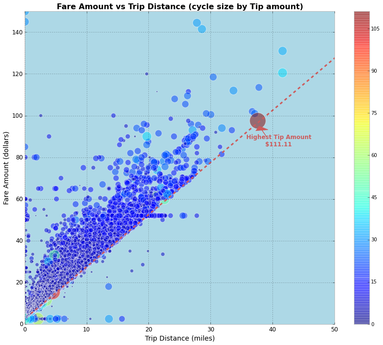

##HW8 uses one week of Boro Taxi data (green cab) 

Data from 2014-06-02 to 2014-06-08

### IDEA 1
####To validate this is a linear relation between metered fare and trip distance
According to TLC's rule, metered fare should be $2.5 initial fare plus 50 cents per 1/5 mile or 50 cents per 60 seconds in slow traffic or when the vehicle is stopped.

From the plot we can see that basically there is a linear relationship among the dash line (meterd fare rule according to trip distance)
Points fall above the line indicates that these trips were experiencing slow traffic thus they followed 50 cents per 60s fare rule for the whole or part of their trip.

### IDEA 2
####See how people pay tips for short/long trips

I used cycle size to represent tip amount. 
From the plot, we can see that some of the short trips have more tip amount than mid-distance trips (left bottom ones).
The highest tip amount is $111.1. The inreseting thing here is that this person actually paid more tips than metered fare ($97.5).

