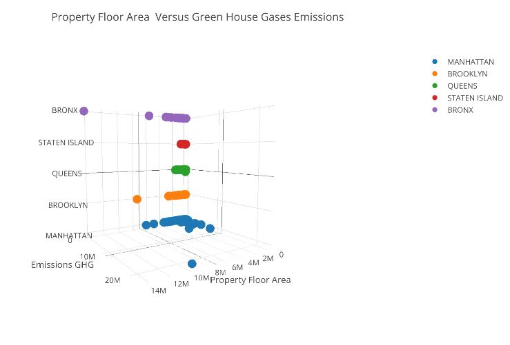

###Plot Review for asc589  UrbanPlanner42

###JG's comments:

X-axis and y-axis units are missing. Using smaller units for the tick marks of GHG emissions may be better since most of the points fall below 10M.

Filter and clean the data for outliers. The purple dot on the left-top coner seems to be an outlier (large floor area but very low GHG emissions) 

Because of the angle of this 3D plot and the overlapped dots (Which is really hard to tell how many dots are overlapped), it is not easy to observe the relationship between Floor area and GHG Emissions.

I would suggest to turn this plot into 2-D, and simply use different colors to represent boroughs.
