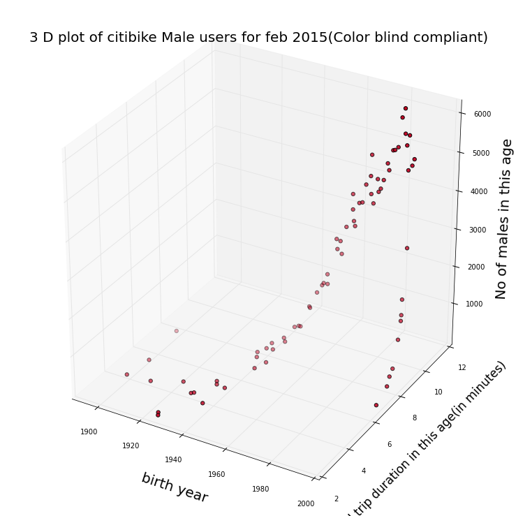
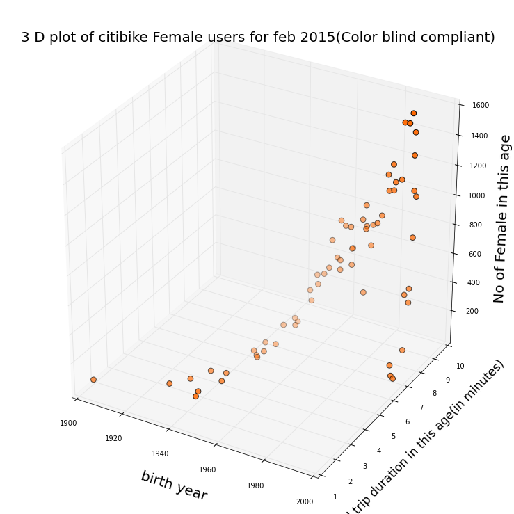

###Plot Review for wh937   winnielucky

###JG's comments:
Reduce the font size of axis title to show the complete titles. (Also it will be better to use 'number' instead of 'No' in the axis title)

Check possible 'outliers' for this study. The data points on the far left side (birth year 1900, which means these people are more than 115 years old??) seem outliers to me.

It is kind of hard to measure the z-axis position (height) of the data points, especially the ones in the middle of the plot. Adding some contour lines or change the 3D plot to 2D and make the trip duration as the circle size might be a better option.

