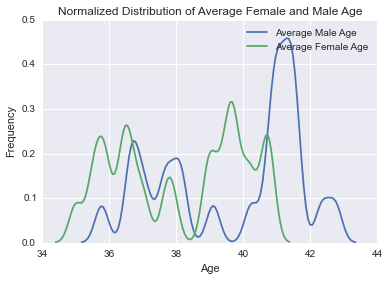

###Plot Review for saf537 

###JG's comments:
Make the figure size larger so that the labels will not ovelap with the line plot.

Missing unit for x-axis (years?)

It is good to normalized the data. The plot itself is nice and clean, the only thing I'm not clear is what does 'average male/female age' here mean? Does the author trying to show average male/female age by time slice? or just simply the age distribution of the riders? 

